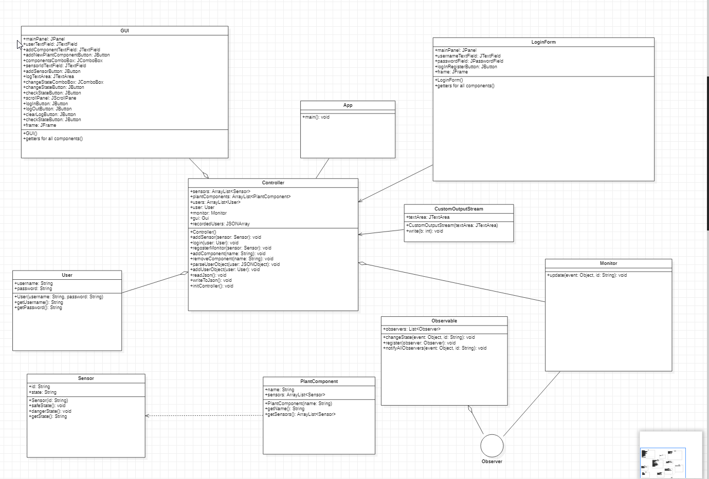
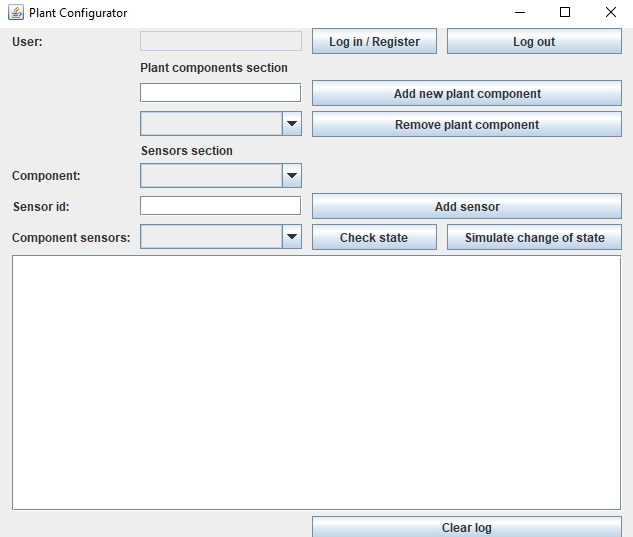
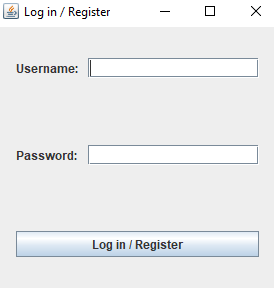

# Plant configurator System
#Requirements:

Consider an application called "Plant Configurator System”. The application should offer the following functionalities:
- User login/register
- Add/remove plant components
- Register a new plant sensor
- Plant sensor status updating
- Plant sensor status checking
##Class diagram

Path:res\img\class_diagram.png

##Classes used for implemeting the application
We are using the observer observable design pattern:

-Observer- interface - it contains the abstract method update that will be implemented by the Monitor class

-Observable - as attributes, we have a list of observers that will be registered separately for each Observable object
  Inside this class we have the changeState method, that notifies every registered Observer of the event, the register Method,
that lets us register an Observer to our instance of Observable, and notifyAllObservers, a method that is used inside of the 
changeState method, that will call for each separate Observer their update method.

-Monitor - a class that we need to implement the Observer interface, so we can implement its method

-User - this class will be used to store the information of each user that logs in a session in separate User objects

-Sensor - the Sensor class extends the Observable class and lets us store the id and the state of said sensor

-PlantComponent - with this class we store the name of each added plant component and a list of their sensors

-GUI- it contains the Swing components used to create the UI. 

-LoginForm- same as for the above, only for the log in window

-Controller - everything that happens behind the interface is done by this class, its methods let us store the users' information
inside JSON objects and read them at the start of each session, and it also contains the listeners for every buton inside the initController method

-CustomOutputStream - it allows the UI to use the JTextArea for the log instead of using the IDE's console

-App - contains the main method that runs the application

##Describing the application

For the user login / register functionality, by clicking on the Log in/ Register Button, a new window will pop-up 
prompting the user to log in or register.

If the user has never logged in before, and his information is not inside users.json, 
it will be logged that a new user has been created. Regardless of this, they will be welcomed next and their username will be 
showed in the textfield on the left of the button.

Being logged in is what allows the user to do any of the other operations. 
He can add plant components, select them from the dropdown menu and remove them, and in the sensors section,

By selecting the component from the dropdown, the user can add sensors to each component.
The sensor navigation is done by selecting the component, and then selecting the sensor from the component sensors dropdown,
where only their respective sensors will be displayed.
Their state can be checked using the check state button, and their state will toggle using the simulate change of state button

Lastly, the log area is scrollable, but if the user wishes, they can clear it by using the clear log button 